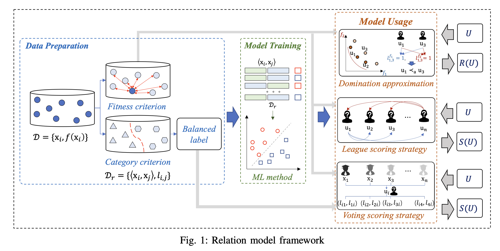

# Relation Model


❗️❗**This is a temporary anonymous repository to ensure anonymity during the review phase.**

---
We are attempting to demonstrate the contribution of relation models to expensive optimization within a complete and unified framework, as shown in the figure below:




The framework includes three modules: `data preparation`, `model training`, and `model usage`. Each module has multiple strategies that can be combined in various ways to form different algorithms, assisting evolutionary algorithms in solving expensive optimization problems.


---
Ths repository has collected some of our research work and code implementations on the **relation model**. The Matlab version implementation of the **relation model** can be found [here](https://github.com/hhyqhh/Relation-matlab/). 


* Python package compatible with [pymoo](https://github.com/anyoptimization/pymoo) (0.6.1) 
* Matlab package compatible with [PlatEMO](https://github.com/BIMK/PlatEMO) (4.x)  
---


## Usage

The Python version algorithm is fully compatible with the pymoo framework.

First, install the package by running the following command in the root directory of the repository:
```bash
pip install -r requirements.txt
python setup.py develop
```

An example of using the DRSO algorithm to solve the LZG01 problem is shown below:
```python
from pymoo.optimize import minimize
from problem.single.LZG import LZG01, LZG02, LZG03, LZG04
from loguru import logger
from algorithm.saea.drso import DRSO


logger.remove()
problem = LZG01(n_var=20)
algorithm = DRSO()
res = minimize(problem,
                algorithm,
                ('n_evals', 500),
                verbose=True)

```

